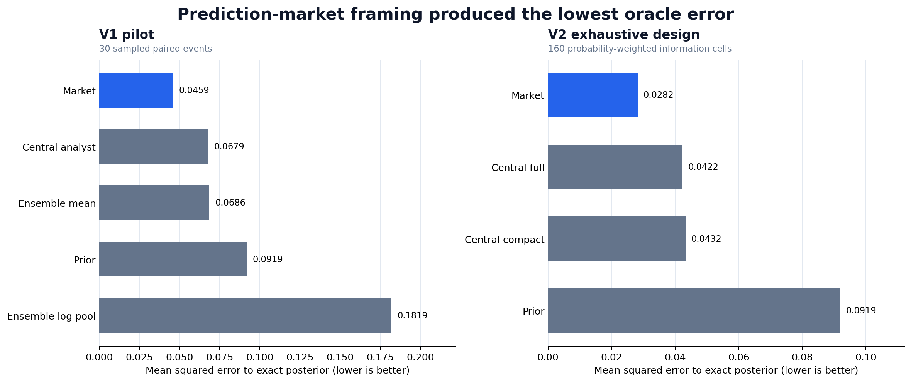
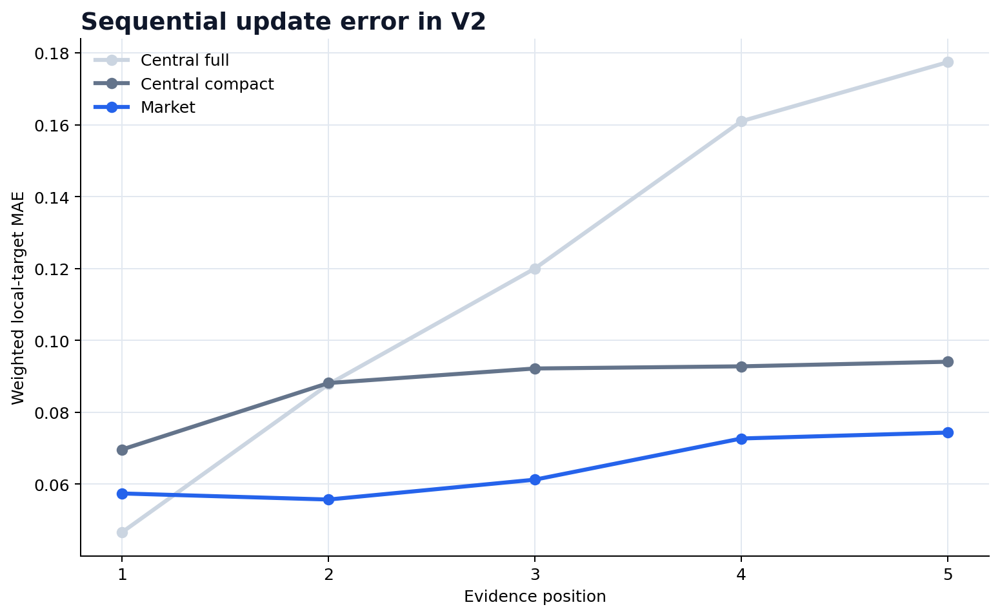

# LLM Information Aggregation: Markets vs Centralized Baselines

Can a prediction-market-style sequence of LLM agents aggregate distributed evidence better than a single LLM and simpler aggregation rules?

This repository contains two controlled experiments using the same local `qwen3:8b` model. The experiments compare prediction-market updates with centralized analysts and, in the pilot, independent ensembles. The task uses synthetic binary signals, so the exact Bayesian posterior is known and aggregation error can be measured directly.

The result is promising but narrow: market-framed updates performed best in both experiments, including an exhaustive 160-cell design. This does **not** establish that multi-agent prediction markets generally outperform single LLMs. In V2, market and compressed-state conditions differ partly in role framing, which is the main unresolved confound.



## Main results

Lower mean squared error (MSE) to the exact Bayesian posterior is better.

| Experiment | Market | Strongest centralized baseline | Result |
|---|---:|---:|---|
| V1 pilot, 30 sampled events | 0.04595 | 0.06791 | Market lower, but the paired 95% bootstrap interval against the central analyst crossed zero |
| V2, 160 exhaustive weighted cells | 0.02816 | 0.04223 | Market error was 33% lower than `central_full` and 35% lower than `central_compact` |

In V1, the market also outperformed the arithmetic-mean ensemble (0.06858) and the prior-corrected log-odds pool (0.18188). V2 then added a stronger compressed-state baseline to test whether the apparent market advantage was simply caused by compressing earlier evidence into a probability.

## Experimental progression

### V1 — exploratory pilot

Thirty paired synthetic events were evaluated by:

- one sequential central analyst;
- five isolated forecasts combined by arithmetic mean;
- the same forecasts combined by a prior-corrected log-odds pool;
- five one-shot traders updating a logarithmic market scoring rule;
- prior-only and exact-Bayes benchmarks.

Every LLM condition used five scheduled calls per event. The market beat both ensembles, while its advantage over the central analyst was not conclusive in the 30-event pilot.

### V2 — exhaustive confirmatory experiment

V2 evaluated all `5 × 2^5 = 160` prior-by-signal-pattern cells and weighted them by their probability under the data-generating process. It compared:

- `central_full`: one analyst repeatedly sees all evidence revealed so far;
- `central_compact`: one analyst sees the current probability and one new signal;
- `market`: a new trader sees the same numerical state as `central_compact`;
- prior-only and exact-Bayes benchmarks.

The market had the lowest weighted oracle error. Because the complete frozen state space was evaluated, this is exact for the observed response surface under this model, prompt family, signal schedule, and matched seeds. It is not evidence of generality across models or real forecasting tasks.



## Why the V2 result is not the final answer

`central_compact` and `market` receive the same numerical information but different role instructions: “same analyst” versus “new trader,” with an explicit market-scoring-rule frame. Ollama calls are stateless, so the observed difference may be a prompt scaffold rather than a general benefit from decentralized organization.

A proposed V3 framing ablation is documented in [`docs/V3_FRAMING_ABLATION.md`](docs/V3_FRAMING_ABLATION.md). It has not been run and is not included in the reported results.

## Repository structure

```text
.
├── experiments/
│   ├── v1_pilot/              # Frozen V1 protocol, code, config, and tests
│   └── v2_confirmatory/       # Frozen V2 protocol, code, config, and tests
├── results/
│   ├── v1_pilot/              # Readable V1 outputs and validation audit
│   ├── v2_confirmatory/       # Readable V2 outputs and diagnostics
│   └── raw_runs/              # Complete compressed run artifacts
├── analysis/make_figures.py   # Recreates the figures from saved CSV files
├── figures/                   # Generated figures used in this README
└── docs/                      # Methodology, limitations, and proposed V3
```

The experiment folders are preserved as run so that their implementation fingerprints remain meaningful. The complete raw run archives include prompts, responses, checkpoints, frozen worlds, and validation records.

## Run the tests

The experiment code uses only the Python standard library. Tests use deterministic mock clients and do not call Ollama.

```bash
python -m unittest discover -s experiments/v1_pilot/tests -v
python -m unittest discover -s experiments/v2_confirmatory/tests -v
```

The repository also runs these 35 tests automatically through GitHub Actions.

## Reproduce an experiment

Requirements:

- Python 3.10 or newer;
- [Ollama](https://ollama.com/) running locally;
- the exact `qwen3:8b` model specified in each configuration.

V1:

```bash
cd experiments/v1_pilot
python run_pilot.py --check
python run_pilot.py
```

V2:

```bash
cd experiments/v2_confirmatory
python run_v2.py --check
python run_v2.py
```

Read each experiment's `PROTOCOL.md` before running it. Changing a frozen configuration, prompt, or implementation creates a different experiment.

To regenerate the figures:

```bash
python -m pip install -r requirements-figures.txt
python analysis/make_figures.py
```

## Documentation

- [`docs/METHODOLOGY.md`](docs/METHODOLOGY.md): experimental design and metrics
- [`docs/LIMITATIONS.md`](docs/LIMITATIONS.md): interpretation boundaries and unresolved threats
- [`docs/V3_FRAMING_ABLATION.md`](docs/V3_FRAMING_ABLATION.md): proposed next experiment
- [`AI_ASSISTANCE.md`](AI_ASSISTANCE.md): project ownership and use of generative AI

## Project ownership and AI assistance

The research question, experimental direction, protocol decisions, execution, and interpretation were led by **Gabriele Criscuolo**. The Python implementation and documentation were developed with generative-AI assistance. Experiments were executed locally with Qwen through Ollama, and the outputs were checked using automated tests and saved validity audits.

See [`AI_ASSISTANCE.md`](AI_ASSISTANCE.md) for the complete disclosure.
